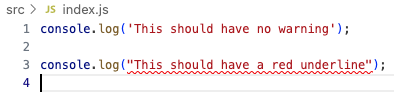

# Node Example

This is an example Node project for students to get familiar with running JavaScript in the terminal and using eslint.

Before starting run `npm install` or `npm i` to install dependencies.

Open up `src/index.js` and if you have eslint configured you should see something like this:

If you see the red squiggly line, then eslint is working properly.
